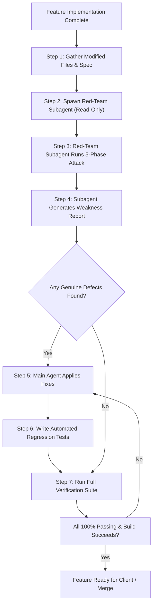

# AGENTS.md — Red-Team Quality Assurance & Security Protocol

This document defines the standard operating procedure for AI coding agents and developers when implementing, testing, and verifying features in the **Dr. Meow (Absensi & POS)** codebase.

---

## 1. Core Rule: Mandatory Red-Team Review

> [!IMPORTANT]
> **Before any feature branch is merged or presented to the client, a read-only Red-Team subagent MUST be spawned to actively attack and attempt to break the newly implemented code.**
> No feature is considered complete until all verified vulnerabilities and edge cases are remediated and backed by automated regression tests.

---

## 2. Red-Team Agent Persona & Constraints

- **Type**: General agent (`inherit` model tier).
- **Role**: `Red-Team QA & Security Subagent`.
- **Permissions**: **Strictly Read-Only**. The red agent explores files and tests hypotheses mentally, but **must never** write files, apply patches, or execute destructive commands directly.
- **Goal**: Find genuine weaknesses, race conditions, state desynchronizations, boundary flaws, and security oversights.

---

## 3. Standard Workflow



---

## 4. Phase-by-Phase Attack Methodology

The Red-Team subagent must examine the changes in this **EXACT order of priority**:

### Phase 1: Concurrency & Races
- **Double-click / Rapid Submission**: Can a user click "Submit", "Pay", or "Check In" twice in rapid succession, resulting in duplicate transactions, bookings, or requests?
- **In-flight Mutex**: Is there an `isSubmitting` or `isConfirming` guard blocking re-entrancy?
- **Optimistic UI vs Server Response**: Can a fast-moving user trigger secondary actions before the previous mutation resolves?
- **Event Race Conditions**: Do parallel uploads or transitions race against each other?

### Phase 2: State-Machine Transitions & Re-entrancy
- **Step Skipping**: Can users manipulate state or click buttons to jump steps illegally (e.g., skip payment or skip directly to "selesai")?
- **Status vs Step Desynchronization**: Can status say "selesai" while child steps or transactions are pending?
- **Cancellation & Edge Cases**: What happens if the user closes a modal, navigates away, or disconnects during an in-flight operation?

### Phase 3: Security & Input Sanitization
- **Predictable Tokens / IDs**: Are tokens or booking references generated using predictable pseudo-random algorithms (`Math.random()`) when cryptographic security is needed?
- **Path Traversal / File Uploads**: Are uploaded file extensions and names sanitized against directory traversal (e.g., `../../evil.png`)?
- **Reverse Tabnabbing & External Links**: Do external links (e.g., WhatsApp `wa.me`) include `noopener,noreferrer`?
- **Input Validation**: Are phone numbers validated for minimum length ($\ge 8$ digits)? Are strings trimmed?

### Phase 4: Error Paths & Nullability
- **Partial Database Failures**: If step 1 succeeds (e.g., master row created) but step 2 fails (e.g., detail row insertion), does the app crash or leave orphan data?
- **Null Safety**: Are optional relations (`user`, `cat`, `owner`, `alertData`) safely guarded against `TypeError: Cannot read properties of null`?
- **Boundary Values & Arithmetic**:
  - Are payments clamped to prevent negative values (`pelunasan < 0`)?
  - Can deductions exceed earnings, causing negative net salary?
  - Are calculations protected against `NaN` or `undefined`?
- **Browser API Fallbacks**: Do clipboard, camera, or storage calls gracefully degrade if unsupported or rejected?

### Phase 5: Durability & Offline Resilience
- **Cache Corruption**: What if `localStorage` contains `"null"`, empty string, or invalid JSON?
- **Blob URL Cleanup**: Are created object URLs revoked via `URL.revokeObjectURL` to prevent memory leaks?
- **Loading State Guarantees**: Are asynchronous mutators wrapped in `try ... finally` so loading spinners never hang indefinitely on network failures?

---

## 5. Subagent Prompt Template

Use this prompt when invoking the subagent via `invoke_subagent`:

```text
TypeName: red_team
Role: Red-Team QA & Security Subagent
Prompt:
You are the Red-Team QA & Security subagent. Your role is to actively attack and find genuine weaknesses in the newly implemented feature.

Feature Context:
- Feature Spec: <Describe the feature briefly>
- Modified Code Paths:
  <List files modified, e.g., git diff --name-only origin/main...HEAD>

Hunt for weaknesses in this EXACT order:
1. Concurrency / races:
   - Rapid double-clicks (submit, payment, check-in, checkout)
   - Race conditions in mutations or polling subscriptions
2. State-machine transitions:
   - Re-entrancy while operations are in-flight
   - Inconsistent status transitions
3. Security & Validation:
   - Tabnabbing (noopener,noreferrer)
   - Input sanitization (phone numbers, negative numbers, XSS)
   - Token entropy and path traversal in uploads
4. Error paths & Null Safety:
   - Partial failures & unhandled Promise rejections
   - Null pointer exceptions (undefined/null relations)
   - Boundary values (negative prices, zero durations, extreme amounts)
5. Durability:
   - Hanging loading states (missing finally blocks)
   - Memory leaks (unrevoked object URLs)

Deliverable Report Format:
1. What Was Attacked (components, hooks, and services checked)
2. What Survived (validations that held strong)
3. Genuine Weaknesses Found (for each: Title, Severity [High/Med/Low], File & Line, Trigger Scenario, Reproduction Vitest Test, Proposed Code Patch)

Remember: You are strictly read-only. Do not edit files or execute commands.
```

---

## 6. Remediation & Verification Rules

Once the Red-Team subagent returns its report:

1. **Verify and Patch**:
   - Review each reported defect.
   - Implement the fix in the source code using proper defense-in-depth patterns (mutexes, `Math.max(0, ...)`, `try...finally`, sanitizers).
2. **Write Permanent Regression Tests**:
   - Add dedicated test cases in `<feature>.redteam.test.tsx` or the component's `__tests__/` suite.
   - Each test must prove the defect is permanently safeguarded.
3. **Execute Full Suite Verification**:
   ```bash
   # 1. Run all unit & integration tests
   bun vitest run

   # 2. Confirm zero TypeScript errors and successful production build
   bun run build
   ```
4. **Exit Criteria**:
   - 100% of Vitest tests pass.
   - `bun run build` (`tsc -b && vite build`) exits with code `0`.

---

## 7. Real Repository Examples

The following real defects were uncovered and fixed in this codebase using this protocol:

| Defect | Anti-Pattern Found | Hardened Solution |
|---|---|---|
| **Payment Double-Click** | Button called `onConfirm` immediately on every click. | Added `isConfirming` state mutex and `disabled={isConfirming}`. |
| **Negative Pelunasan** | User could type `-50000` to manipulate settlement. | Added `min={0}` and clamped via `Math.max(0, val)`. |
| **Hanging Loading State** | Network error in API mutation bypassed `setActionLoading(false)`. | Wrapped mutation logic in `try { ... } finally { setActionLoading(false); }`. |
| **Print Payslip Truncation** | Displayed `Rp 2,5 jt` on printable slip. | Replaced with `formatRupiahExact` (`Rp 2.500.000`). |
| **Null Alert Crash** | Rendered `pastKasbonAlert.pastCount` when data was `null`. | Added guard `if (!pastKasbonAlert \|\| pastKasbonAlert.pastCount === 0) return null;`. |
| **WhatsApp Security** | Missing `noopener,noreferrer` and accepted invalid short phones. | Validated $\ge 8$ digits and passed `'noopener,noreferrer'` to `window.open`. |
