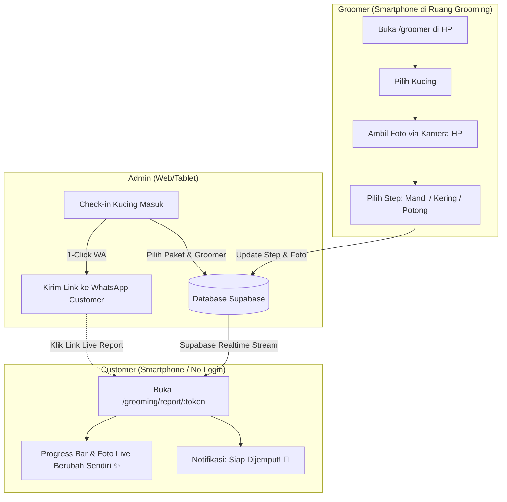

# 🐾 Pet Grooming Live Report (Revisi v2 — Fixed) — Implementation Plan

## Goal

Menambahkan **Modul Live Report Grooming** ke sistem Dr. Meow untuk memutus rantai operasional yang lambat:  
*Sebelumnya:* **Groomer foto di HP → kirim WA ke Admin → Admin forward WA ke Customer**  
*Solusi Baru:* **Groomer update step & foto langsung dari HP di workstation → Customer pantau live via 1 link mandiri**

### Keputusan Revisi v2 (Berdasarkan Feedback):
1. **Tanpa Wablas API di Phase 1**: Menggunakan **1-Click WhatsApp Share Link (`wa.me`)** seperti modul Penitipan. Rp 0 biaya bulanan, tanpa Edge Functions, bebas risiko banned nomor WA, dan bisa langsung go-live dalam hitungan hari.
2. **Dedicated Groomer Mobile View (`/groomer`)**: Groomer dapat login di smartphone dan mengunggah foto langsung dari kamera HP dengan tombol taktil besar, tanpa harus repot lewat admin.
3. **Supabase Realtime pada Report Customer (`/grooming/report/:token`)**: Customer melihat progress step dan foto terupdate secara otomatis dan instan tanpa perlu reload browser.

---

## User Review Required

> [!IMPORTANT]
> **Akses Akun Groomer**: Saat ini, role `employee` dibatasi dari akses web admin. Pada rencana ini, kita membuka rute mobile khusus `/groomer` untuk role `employee` (atau staf dengan jabatan Groomer) sehingga mereka bisa mengelola antrian grooming mereka langsung dari smartphone di workstation tanpa bisa mengakses data rahasia (HR/Payroll/Keuangan).

> [!NOTE]
> **Estimasi Pengerjaan untuk Kak Fara**:
> - **Total waktu**: **2 – 3 Hari Kerja** (MVP siap operasional).
> - **Hari 1**: Database Supabase, Realtime Publication, Service & Types.
> - **Hari 2**: Admin Check-in & Dashboard, Portal Groomer Mobile (`/groomer`), 1-Click WA Share.
> - **Hari 3**: Public Customer Live Report (`/grooming/report/:token`), upload kamera HP, testing end-to-end.

---

## Architecture Overview



---

## Proposed Changes

### Component 1: Database Schema (Supabase `pos` Schema)

Semua tabel dibuat dalam schema `pos` agar terintegrasi rapi dengan data `pos.owners` dan `pos.cats`.

**Jalankan SQL berikut di Supabase Dashboard → SQL Editor:**

#### [NEW] `pos.grooming_sessions`
```sql
create table pos.grooming_sessions (
  id uuid primary key default gen_random_uuid(),
  owner_id uuid references pos.owners(id) on delete cascade not null,
  cat_id uuid references pos.cats(id) on delete cascade not null,
  
  -- Layanan
  paket text not null,                          -- e.g. 'Full Groom', 'Mandi Kutu'
  harga numeric(12,2) not null,                 -- total biaya
  kondisi_awal text,                            -- e.g. 'Ada jamur telinga kiri, gimbal di ekor'
  catatan text,                                 -- pesan khusus owner
  
  -- Waktu
  tanggal date not null default current_date,
  waktu_masuk timestamptz default now(),
  waktu_selesai timestamptz,
  estimasi_selesai timestamptz,
  
  -- Status Pelacakan
  status text default 'antrian' 
    check (status in ('antrian', 'dikerjakan', 'selesai', 'dibatalkan', 'dijemput')),
  current_step text default 'check_in'
    check (current_step in ('check_in', 'bathing', 'drying', 'styling', 'finishing', 'done')),
  
  -- Token Publik (Customer View)
  public_token text unique not null default encode(gen_random_bytes(16), 'hex'),
  
  -- Pembayaran
  sudah_bayar boolean default false,
  metode_bayar text,
  
  -- Penugasan Groomer (tanpa FK cross-schema untuk hindari coupling ke hr schema)
  groomer_user_id uuid,                         -- stores auth.uid() of the groomer, for audit
  groomer_name text,                            -- display name for customer report
  
  created_at timestamptz default now()
);

-- Index token untuk akses cepat customer
create index idx_grooming_sessions_token on pos.grooming_sessions(public_token);
```

#### [NEW] `pos.grooming_progress`
```sql
create table pos.grooming_progress (
  id uuid primary key default gen_random_uuid(),
  session_id uuid references pos.grooming_sessions(id) on delete cascade not null,
  
  step text not null 
    check (step in ('check_in', 'bathing', 'drying', 'styling', 'finishing', 'done')),
  catatan text,                                 -- catatan groomer di step ini
  foto_url text,                                -- foto hasil proses step ini
  
  created_at timestamptz default now()
);

create index idx_grooming_progress_session on pos.grooming_progress(session_id);
```

#### [NEW] `pos.paket_grooming`
```sql
create table pos.paket_grooming (
  id uuid primary key default gen_random_uuid(),
  nama text not null,
  harga numeric(12,2) not null,
  deskripsi text,
  durasi_estimasi int,                          -- perkiraan menit pengerjaan
  aktif boolean default true
);

-- Default data paket grooming Dr. Meow
insert into pos.paket_grooming (nama, harga, deskripsi, durasi_estimasi) values
  ('Mandi Sehat / Biasa', 65000,  'Shampoo premium, conditioner, bersihkan telinga, potong kuku, blow dry', 45),
  ('Mandi Kutu / Jamur',  85000,  'Shampoo obat treatment, bilas bersih, potong kuku, blow dry', 60),
  ('Full Grooming',       120000, 'Mandi lengkap, potong kuku, styling/cukur rapi, parfum cat-safe', 90),
  ('Cukur Gundul / Lion', 100000, 'Shaving bulu gimbal/lion cut + mandi antiseptic', 75);
```

---

#### Supabase Realtime Publication + Replica Identity

```sql
-- Aktifkan Realtime untuk kedua tabel agar customer melihat pembaruan seketika
alter publication supabase_realtime add table pos.grooming_sessions;
alter publication supabase_realtime add table pos.grooming_progress;

-- WAJIB: agar Realtime streaming mengirim seluruh kolom pada event UPDATE
-- (tanpa ini, UPDATE event hanya kirim primary key + kolom yang berubah saja)
alter table pos.grooming_sessions replica identity full;
alter table pos.grooming_progress replica identity full;
```

---

#### RLS Policies

```sql
alter table pos.grooming_sessions enable row level security;
alter table pos.grooming_progress enable row level security;
alter table pos.paket_grooming enable row level security;

-- Akses authenticated (admin & employee) — full CRUD
create policy "Staff manage sessions" on pos.grooming_sessions
  for all to authenticated using (true) with check (true);
create policy "Staff manage progress" on pos.grooming_progress
  for all to authenticated using (true) with check (true);
create policy "Staff manage paket" on pos.paket_grooming
  for all to authenticated using (true) with check (true);

-- Akses publik anon — SELECT saja (diperlukan agar Realtime subscription berfungsi)
-- Keamanan sesungguhnya dijaga oleh public_token yang bersifat unguessable (32 hex chars)
-- + filter pada Realtime channel subscription di client
create policy "Public read session" on pos.grooming_sessions
  for select to anon using (true);

create policy "Public read progress" on pos.grooming_progress
  for select to anon using (true);
```

---

#### Secure RPC Function (untuk Initial Fetch Customer Report)

Fungsi ini digunakan saat customer pertama kali membuka link report.
Lebih aman daripada query langsung karena hanya mengembalikan data yang cocok dengan token.

```sql
create or replace function pos.get_grooming_report(p_token text)
returns json
language plpgsql
security definer
set search_path = pos
as $$
declare
  result json;
begin
  select json_build_object(
    'session', json_build_object(
      'id', s.id,
      'paket', s.paket,
      'harga', s.harga,
      'kondisi_awal', s.kondisi_awal,
      'catatan', s.catatan,
      'tanggal', s.tanggal,
      'waktu_masuk', s.waktu_masuk,
      'waktu_selesai', s.waktu_selesai,
      'estimasi_selesai', s.estimasi_selesai,
      'status', s.status,
      'current_step', s.current_step,
      'public_token', s.public_token,
      'groomer_name', s.groomer_name,
      'created_at', s.created_at
    ),
    'cat', json_build_object(
      'nama', c.nama,
      'ras', c.ras,
      'warna', c.warna,
      'foto_url', c.foto_url
    ),
    'progress', coalesce((
      select json_agg(
        json_build_object(
          'id', p.id,
          'step', p.step,
          'catatan', p.catatan,
          'foto_url', p.foto_url,
          'created_at', p.created_at
        ) order by p.created_at asc
      )
      from pos.grooming_progress p
      where p.session_id = s.id
    ), '[]'::json)
  ) into result
  from pos.grooming_sessions s
  join pos.cats c on c.id = s.cat_id
  where s.public_token = p_token;

  return result;
end;
$$;
```

**Cara pakai di frontend (customer report page):**
```typescript
// Initial fetch — aman, hanya return data untuk token yang cocok
const { data } = await supabase.rpc('get_grooming_report', { p_token: token })

// Realtime subscription — filter by token agar hanya terima event milik sesi ini
supabase.channel(`grooming-${token}`)
  .on('postgres_changes', {
    event: '*',
    schema: 'pos',
    table: 'grooming_sessions',
    filter: `public_token=eq.${token}`,
  }, handleSessionUpdate)
  .on('postgres_changes', {
    event: 'INSERT',
    schema: 'pos',
    table: 'grooming_progress',
    filter: `session_id=eq.${sessionId}`,  // set after initial fetch
  }, handleProgressInsert)
  .subscribe()
```

---

### Component 2: TypeScript Types & Helper

#### [MODIFY] [pos.ts](file:///d:/Coding%20Turu/Absensi/src/types/pos.ts)
Tambahkan types untuk modul grooming:
```typescript
export type GroomingStep = 'check_in' | 'bathing' | 'drying' | 'styling' | 'finishing' | 'done'
export type GroomingStatus = 'antrian' | 'dikerjakan' | 'selesai' | 'dibatalkan' | 'dijemput'

export interface GroomingSession {
  id: string
  owner_id: string
  cat_id: string
  paket: string
  harga: number
  kondisi_awal?: string
  catatan?: string
  tanggal: string
  waktu_masuk: string
  waktu_selesai?: string
  estimasi_selesai?: string
  status: GroomingStatus
  current_step: GroomingStep
  public_token: string
  sudah_bayar: boolean
  metode_bayar?: string
  groomer_user_id?: string
  groomer_name?: string
  created_at: string
  owner?: Owner
  cat?: Cat
  progress?: GroomingProgress[]
}

export interface GroomingProgress {
  id: string
  session_id: string
  step: GroomingStep
  catatan?: string
  foto_url?: string
  created_at: string
}

export interface PaketGrooming {
  id: string
  nama: string
  harga: number
  deskripsi?: string
  durasi_estimasi?: number
  aktif: boolean
}
```

#### [NEW] `src/constants/grooming.constants.ts`
```typescript
export const GROOMING_STEPS = [
  'check_in',
  'bathing',
  'drying',
  'styling',
  'finishing',
  'done',
] as const

export const GROOMING_STEP_LABELS: Record<string, string> = {
  check_in: 'Check-in',
  bathing: 'Mandi / Bathing',
  drying: 'Pengeringan / Blow Dry',
  styling: 'Styling / Potong Bulu',
  finishing: 'Finishing Touch',
  done: 'Selesai',
}

export const GROOMING_STEP_EMOJI: Record<string, string> = {
  check_in: '📋',
  bathing: '🛁',
  drying: '💨',
  styling: '✂️',
  finishing: '✨',
  done: '🎉',
}

export const GROOMING_STATUS_LABELS: Record<string, string> = {
  antrian: 'Antrian',
  dikerjakan: 'Sedang Dikerjakan',
  selesai: 'Selesai',
  dibatalkan: 'Dibatalkan',
  dijemput: 'Sudah Dijemput',
}
```

#### [NEW] `src/utils/grooming.utils.ts`
Fungsi generator template WhatsApp 1-Klik (`wa.me`):
* `generateGroomingCheckinWa(session, publicUrl, namaUsaha)`: Pesan konfirmasi check-in + tautan live report.
* `generateGroomingDoneWa(session, publicUrl, namaUsaha)`: Pesan pemberitahuan grooming selesai + kucing siap dijemput.
* `getGroomingReportUrl(publicToken)`: Generate full URL `{window.location.origin}/grooming/report/{token}`.

---

### Component 3: Data Access & Realtime Hook

#### [NEW] `src/services/groomingService.ts`
* `fetchSessions(filter)`: Ambil daftar grooming hari ini / berdasarkan status.
* `fetchSessionById(id)`: Ambil detail sesi untuk admin/groomer.
* `fetchReportByToken(token)`: Panggil RPC `pos.get_grooming_report(token)` untuk customer.
* `createSession(data)`: Check-in grooming baru + generate `public_token`.
* `updateStep(sessionId, step, status)`: Pindah step pengerjaan.
* `addProgress(sessionId, step, fotoUrl, catatan)`: Tambahkan foto & catatan progress.
* `markPickedUp(sessionId)`: Update status ke `dijemput`.
* `uploadGroomingPhoto(file, sessionId, step)`: Upload ke `cat-photos/grooming/{sessionId}/{step}-{timestamp}.jpg`.

**Storage path convention:**
```
cat-photos/grooming/{sessionId}/{step}-{timestamp}.jpg
```
Contoh: `cat-photos/grooming/abc123/bathing-1726315200.jpg`

#### [NEW] `src/hooks/grooming/useGroomingRealtime.ts`
Hook khusus customer report:
* Melakukan initial fetch data via `supabase.rpc('get_grooming_report', { p_token })`.
* Membuka koneksi `supabase.channel` untuk mendengar event `UPDATE` pada `pos.grooming_sessions` (filter by `public_token`) & `INSERT` pada `pos.grooming_progress` (filter by `session_id`).
* Secara reaktif memperbarui state tanpa refresh halaman.

#### [NEW] `src/hooks/grooming/useGroomingSessions.ts`
TanStack Query hook untuk admin dashboard (list, filter, stats).

#### [NEW] `src/hooks/grooming/useGroomingForm.ts`
Hook untuk form check-in grooming baru (owner search, cat selection, package selection, submission mutation).

---

### Component 4: Pages & UI Implementation

#### [NEW] `src/pages/grooming/GroomerWorkstation.tsx` (Portal Khusus Groomer Mobile — `/groomer`)
* **Mobile-first UI**: Didesain khusus untuk layar HP groomer di area basah/grooming.
* **Daftar Kucing Aktif**: Tab "Antrian Kucing Saya" & "Sedang Dikerjakan".
* **Aksi 1-Tap**:
  * Tombol besar: **"Mulai Mandi 🛁"**, **"Mulai Pengeringan 💨"**, **"Mulai Potong/Styling ✂️"**, **"Selesai ✨"**.
  * Input kamera langsung: `<input type="file" accept="image/*" capture="environment">` sehingga groomer tinggal jepret foto tanpa ribet.
  * Preview foto instan + input catatan singkat (misal: "Bulu kusut sudah dirapikan").
* **Tidak ada sidebar admin** — layout bersih, standalone mobile page.

#### [NEW] `src/pages/grooming/GroomingReport.tsx` (Public Live Report Customer — `/grooming/report/:token`)
* **No Login Required**: Bisa dibuka di browser HP apapun dari link WhatsApp.
* **Realtime Live Visual**:
  * Status banner aktif dengan badge animasi lembut.
  * Progress timeline step-by-step: Check-in → Mandi → Pengeringan → Styling → Siap Dijemput.
  * Kartu foto di setiap tahap pengerjaan.
  * Banner "Siap Dijemput! 🎉" saat status sudah selesai.
  * Tombol "Hubungi Salon" (buka WA admin langsung jika ada pertanyaan).
* **Initial data via RPC** (`pos.get_grooming_report`) — aman, hanya return data per token.
* **Live updates via Realtime channel** — filter by `public_token` dan `session_id`.

#### [NEW] `src/pages/grooming/GroomingDashboard.tsx` (Admin Hub — `/admin/grooming`)
* Ringkasan statistik hari ini: Antrian, Sedang Dikerjakan, Selesai, Total Omset Grooming.
* Tabel/Grid sesi grooming dengan indikator progress dan status pembayaran.
* Tombol aksi cepat: "Kirim Link WA", "Edit", "Selesai & Dijemput".

#### [NEW] `src/pages/grooming/GroomingCheckIn.tsx` (Check-in Grooming Baru — `/admin/grooming/new`)
* Cari / Tambah Owner & Kucing (menggunakan data `pos.owners` & `pos.cats` yang sudah ada).
* Pilih Paket Grooming & Assign Groomer.
* Catat kondisi fisik awal kucing (jamur, kutu, luka).
* Modal konfirmasi Check-in langsung menampilkan tombol **"Kirim Link ke WhatsApp Owner"**.

#### [NEW] `src/pages/grooming/GroomingPengaturan.tsx` (Pengaturan Paket Grooming — `/admin/grooming/pengaturan`)
* CRUD paket grooming (tambah, edit harga, toggle aktif — soft delete).
* Preview template pesan WhatsApp.

---

### Component 5: Router & Sidebar Updates

#### [MODIFY] [router.tsx](file:///d:/Coding%20Turu/Absensi/src/router.tsx)

```diff
+ import GroomingDashboard from "@/pages/grooming/GroomingDashboard";
+ import GroomingCheckIn from "@/pages/grooming/GroomingCheckIn";
+ import GroomingPengaturan from "@/pages/grooming/GroomingPengaturan";
+ import GroomerWorkstation from "@/pages/grooming/GroomerWorkstation";
+ import GroomingReport from "@/pages/grooming/GroomingReport";

 export const router = createBrowserRouter([
   {
     element: <AuthLayout />,
     children: [
+      // ── PUBLIC ROUTE (tanpa auth — customer buka dari link WA) ──
+      {
+        path: "/grooming/report/:token",
+        element: <GroomingReport />,
+      },
       {
         path: "/",
         element: <Navigate to="/admin/dashboard" replace />,
       },
       {
         path: "/login",
         element: <LoginPage />,
       },
       {
         element: <AuthGuard />,
         children: [
           // ... existing HR routes (superadmin only) ...

+          // ── GROOMER MOBILE ROUTE — semua role authenticated ──
+          {
+            element: <RoleGuard allowedRoles={["superadmin", "admin", "employee"]} />,
+            children: [
+              {
+                path: "/groomer",
+                element: <GroomerWorkstation />,
+              },
+            ],
+          },

           {
             // POS routes — superadmin + admin
             element: <RoleGuard allowedRoles={["superadmin", "admin"]} />,
             children: [
               // ... existing POS boarding routes ...

+              // ── Grooming Admin routes ──
+              {
+                path: "/admin/grooming",
+                element: <GroomingDashboard />,
+              },
+              {
+                path: "/admin/grooming/new",
+                element: <GroomingCheckIn />,
+              },
+              {
+                path: "/admin/grooming/pengaturan",
+                element: <GroomingPengaturan />,
+              },
             ],
           },
         ],
       },
     ],
   },
 ]);
```

> [!IMPORTANT]
> **Fix RoleGuard untuk employee**: Saat ini `RoleGuard` menampilkan layar "Akses Terbatas" untuk employee (line 71-82 di router.tsx). Perlu ditambahkan pengecekan: jika employee mengakses path `/groomer`, jangan tampilkan layar terbatas — langsung `<Outlet />`. Caranya: update logika di blok `else if (user.role === "employee")` untuk mengecek `location.pathname.startsWith('/groomer')`.

#### [MODIFY] [AdminLayout.tsx](file:///d:/Coding%20Turu/Absensi/src/components/layout/AdminLayout.tsx)

Tambahkan sub-menu "Grooming Kucing" di sidebar setelah "Penitipan Kucing":

```tsx
// Setelah NavItem Pengaturan POS (sekitar line 155):

<div className="px-6 pt-5 pb-2 font-mono text-[10px] tracking-[1.5px] uppercase text-brand-accent font-semibold shrink-0">
  Grooming
</div>
<NavItem
  to="/admin/grooming"
  icon={Scissors}
  label="Dashboard Grooming"
  activeMatcher={pathname => pathname === '/admin/grooming'}
  onClick={() => setMobileOpen(false)}
/>
<NavItem to="/admin/grooming/new" icon={PlusCircle} label="Grooming Baru" onClick={() => setMobileOpen(false)} />
<NavItem to="/admin/grooming/pengaturan" icon={Settings} label="Pengaturan Grooming" onClick={() => setMobileOpen(false)} />
```

---

## Complete File Manifest

| Action | Path | Description |
|--------|------|-------------|
| **SQL** | Supabase SQL Editor | 3 tables + RPC function + Realtime + Replica Identity + RLS |
| **MODIFY** | `src/types/pos.ts` | Tambah grooming interfaces |
| **NEW** | `src/constants/grooming.constants.ts` | Step labels, emoji, status labels |
| **NEW** | `src/utils/grooming.utils.ts` | WA templates + report URL generator |
| **NEW** | `src/services/groomingService.ts` | Data access layer + RPC call + photo upload |
| **NEW** | `src/hooks/grooming/useGroomingRealtime.ts` | Realtime subscription hook (customer) |
| **NEW** | `src/hooks/grooming/useGroomingSessions.ts` | Admin list/filter hook |
| **NEW** | `src/hooks/grooming/useGroomingForm.ts` | Check-in form hook |
| **NEW** | `src/pages/grooming/GroomerWorkstation.tsx` | Mobile groomer portal (`/groomer`) |
| **NEW** | `src/pages/grooming/GroomingReport.tsx` | Public customer live report |
| **NEW** | `src/pages/grooming/GroomingDashboard.tsx` | Admin dashboard |
| **NEW** | `src/pages/grooming/GroomingCheckIn.tsx` | Admin check-in wizard |
| **NEW** | `src/pages/grooming/GroomingPengaturan.tsx` | Pengaturan paket grooming |
| **MODIFY** | `src/router.tsx` | Add routes + groomer role group + fix RoleGuard |
| **MODIFY** | `src/components/layout/AdminLayout.tsx` | Add Grooming sidebar section |

---

## Verification Plan

### Automated Tests & Quality Checks
```bash
# Typecheck TypeScript untuk memastikan seluruh interface dan routes valid
npx tsc --noEmit

# Linting
npm run lint
```

### Manual Operational Verification
1. **Admin Check-in Flow**:
   - Buka `/admin/grooming/new`, pilih kucing & paket, submit.
   - Klik tombol **"Buka WhatsApp"** → pastikan link `wa.me` membuka WhatsApp dengan URL report yang valid.
2. **Groomer Mobile Flow**:
   - Login sebagai employee, buka `/groomer` di browser HP atau simulasi responsive.
   - Pilih kucing → jepret foto kamera → klik "Simpan & Lanjut ke Mandi".
   - Pastikan employee **tidak bisa** mengakses `/admin/*` routes.
3. **Customer Realtime Flow**:
   - Buka link `/grooming/report/:token` di tab incognito / HP lain (tanpa login).
   - Lakukan update step dari portal Groomer → pastikan layar customer berubah secara **live realtime** dalam < 1 detik tanpa reload halaman.
4. **RPC Security Check**:
   - Coba akses `/grooming/report/invalid-token` → harus menampilkan "Sesi tidak ditemukan".
   - Pastikan customer hanya bisa melihat data sesi yang cocok dengan token di URL.
5. **Storage Upload**:
   - Upload foto dari kamera HP groomer → pastikan tersimpan di `cat-photos/grooming/{sessionId}/{step}-{timestamp}.jpg`.
   - Pastikan foto tampil di customer report page.
